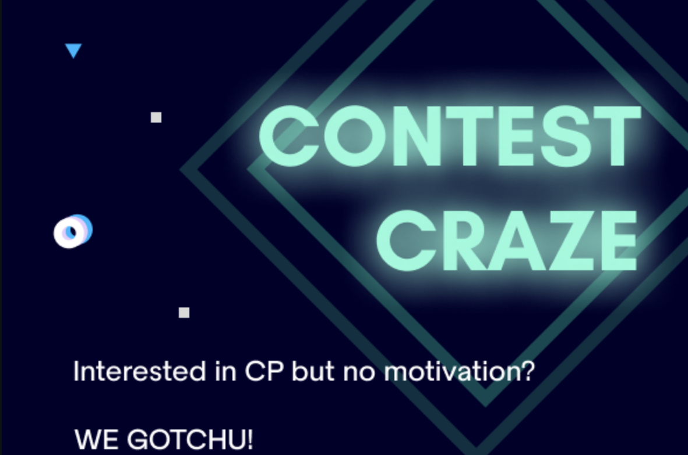

> The most minimal website available to track your journey on Codeforces and motivate you towards competitive programming.

# Contest Tracker and Reward System Website 

---

### Table of Contents

  - [Description](#description)
      - [Key Features](#key-features)
      - [Technologies](#technologies)
  - [How To Use](#how-to-use)
      - [Login](#login)
      - [Register](#register)
      - [Profile](#profile)
  - [Installation](#installation)

---

## Description

The website fetches all the information from the [CODEFORCES API](https://codeforces.com/api/user.info?handles={codeforces_handle})
ans [LICHESS API](https://lichess.org/api/user/{lichess_handle}) and few other API's for getting info for other stuffs and rewards you on the basis of your performance.

---

#### Key Features
Some key features of the site are:
- LogIn / LogOut for users
- Notifies you about upcoming contests
- Ranknig System 
- Redeem coupons from points 
- Email Verification
- Forget Password option for Resetting Password
- Can track Lichess journey too...

---

#### Technologies

- Front End: HTML, CSS (+ BootStrap)
- Back End: Django ( + allauth and few other python libraries)

---

## How To Use

Set your local Environment following the steps given in the intallation section

---

#### Login

This page can be accessed from the top right corner of Movie Details page or home page if not already logged in.
For new users, user can register using their google account or register using their email and password. There is also a forgot password button, which can be used to reset the password of the user.

