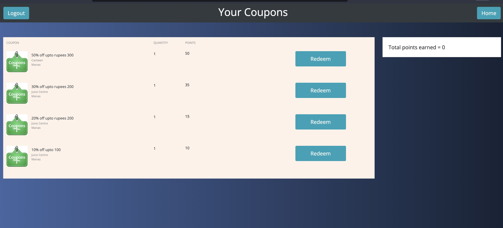

> The most minimal website available to track your journey on Codeforces and motivate you towards competitive programming.

# Contest Tracker and Reward System Website 

---

### Table of Contents


  - [Description](#description)
      - [Key Features](#key-features)
      - [Technologies](#technologies)
  - [How To Use](#how-to-use)
      - [Login](#login)
      - [Register](#register)
      - [Profile](#profile)
      - [Rewards](#rewards)
      - [Leaderboard](#leaderboard)
  - [Installation](#installation)

---

## Description

The website fetches all the information from the [CODEFORCES API](https://codeforces.com/api/user.info?handles={codeforces_handle})
ans [LICHESS API](https://lichess.org/api/user/{lichess_handle}) and few other API's for getting info for other stuffs and rewards you on the basis of your performance.

---

#### Key Features
Some key features of the site are:
- LogIn / LogOut for users
- Notifies you about upcoming contests
- Ranknig System 
- Redeem coupons from points 
- Email Verification
- Forget Password option for Resetting Password
- Can track Lichess journey too...

---

#### Technologies

- Front End: HTML, CSS (+ BootStrap)
- Back End: Django ( + allauth and few other python libraries)

---

## How To Use

Set your local Environment following the steps given in the intallation section

---

#### Login

This page comes on your screen as the first page of website. For new users, their is link, at register where you can click and go to register page. There is also a reset password button, which can be used to reset the password of the user.


#### Register

This page can be accessed from the login page.


#### Profile

This page offers you the form to enter your codeforces and lichess handle if not already entered, after entering it shows you user information this page also shows you upcoming contests on codeforces and codeforces history . Your history is traked from the time you enter your codeforces handle.


#### Rewards

This page shows you your total score and the available coupons



#### Leaderboard

This shows the ranking among the registered users in a specific contest ans shows what amount of points they won.


## Installation

- Step 1: Clone this repository into your local machine. (See [here](https://docs.github.com/en/repositories/creating-and-managing-repositories/cloning-a-repository))
- Step 2: Create a virtual environment and activate it. (See [here](https://docs.python.org/3/tutorial/venv.html))
```bash
source venv/bin/activate
```
- Step 3: Install all the dependencies. 
```bash
pip install -r requirements.txt
```
- Step 4: Run the django server.
```bash
python manage.py runserver
```

## Author Info

#### Aditya Gupta

- Email - [aditya.cse21@iitg.ac.in](mailto:aditya.cse21@iitg.ac.in)
- Github - [guptaaditya30121](https://github.com/guptaaditya30121)

#### Akshat


